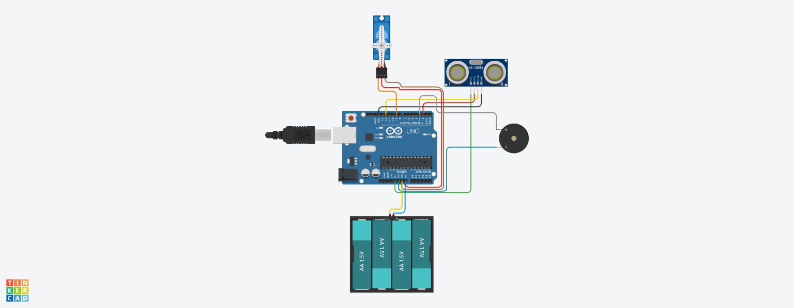
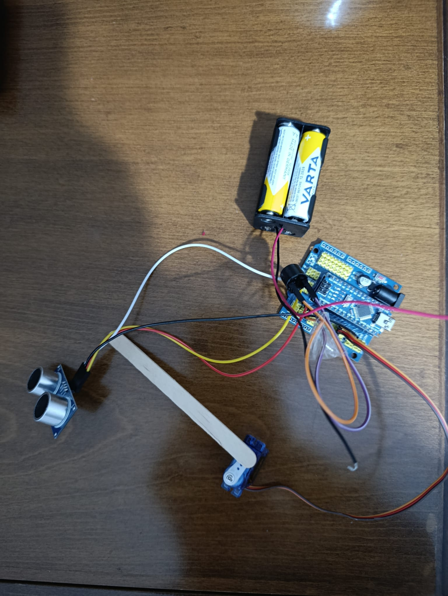

# 🚰 Smart Faucet System (Arduino & Distance Sensor)

This project aims to create an automated faucet system using an **HC-SR04 ultrasonic sensor**, **Arduino Nano**, and an **SG90 micro servo motor**. When a hand is detected within range, the water automatically turns on and shuts off with a short delay once the hand is removed. The system is designed for **water conservation** and **improved hygiene**.

---

## 🚀 About the Project

Unlike traditional faucets, this smart system automatically triggers water flow upon detection, eliminating the need for physical contact. This prevents unnecessary water consumption and enhances hygiene levels, offering a practical solution for public areas or frequently used home sinks.

## 📺 Video Demonstration
*(You can link your CozumLab YouTube video here in the future)*

---

## 🛠️ Requirements

To build this project, you will need the following hardware and software:

**Hardware:**
* **Arduino Nano** (or compatible board)
* **HC-SR04** Ultrasonic Distance Sensor
* **SG90** Micro Servo Motor
* **Buzzer** (5V)
* **LEDs** (Green and Red)
* **Resistors** (220 Ohm or 330 Ohm for LEDs)
* **6V Battery Pack** (4x AA/AAA batteries) - External power for the Servo
* **Jumper Wires** (Male-to-Male)
* **Breadboard**
* **USB Cable** (For programming the Arduino)

**Software:**
* **Arduino IDE**

---

## 📊 Wiring Diagram (Fritzing + Live View)

The following diagram shows how to connect all components to the Arduino Nano. Pay special attention to power connections.

  
  

**Pin Connection Table:**

| Component | Arduino Nano Pin | Notes |
| :--- | :--- | :--- |
| **HC-SR04 VCC** | 5V | Power for distance sensor |
| **HC-SR04 Trig** | D2 | Trigger pin |
| **HC-SR04 Echo** | D12 | Echo signal pin |
| **HC-SR04 GND** | GND | Ground |
| **Servo Signal** | D9 | Servo control pin |
| **Servo VCC** | **External 6V (+) ** | **IMPORTANT: Connect directly to battery pack** |
| **Servo GND** | Arduino GND & Bat (-) | Common ground line |
| **Buzzer (+)** | D3 | Audio feedback |
| **Green LED (+)** | D4 | Faucet ON indicator |
| **Red LED (+)** | D5 | Faucet OFF indicator |
| **6V Battery (+)** | Arduino Nano VIN | Main power source |

---

## 🔧 Installation Steps

1. **Arduino IDE Setup:** Download and install the [Arduino IDE](https://www.arduino.cc/en/software).
2. **Library Installation:** The `Servo.h` library comes pre-installed with the Arduino IDE.
3. **Copy the Code:** Copy the contents of the `Smart_Faucet_System.ino` file from this repository.
4. **Paste & Verify:** Open Arduino IDE, create a new sketch, and paste the code.
5. **Board Selection:**
    * Select `Tools > Board > Arduino Nano`.
    * Ensure `Tools > Processor > ATmega328P (Old Bootloader)` is selected if using clones.
    * Select the correct COM port.
6. **Upload:** Connect the USB cable (without batteries connected) and upload the code.
7. **Assembly:** Follow the wiring diagram to assemble on a breadboard. **Ensure common GND between the battery and Arduino.**
8. **Power Up:** Disconnect USB and connect the 6V battery pack.

---

## 💡 Usage

* Place your hand within the `algilamaMesafesi` (default 15 cm).
* The faucet opens, the **Green LED** turns on, and a short "beep" is heard.
* Once you remove your hand, the system waits for the `emniyetSuresi` (default 1 second), then closes the faucet, turns on the **Red LED**, and emits two short beeps.

---

## 📝 Code Overview

* `algilamaMesafesi`: Defines the detection threshold (in cm).
* `emniyetSuresi`: The delay before closing the faucet to prevent rapid flickering (in ms).
* `mesafeOlc()`: Function to handle the HC-SR04 pulse calculation.
* `muslukAc()` & `muslukKapat()`: Controls the servo position, LEDs, and buzzer feedback.

---

**Developer:** Yunus Kunduz  
**YouTube Channel:** [CozumLab](https://www.youtube.com/@CozumLabTR)
